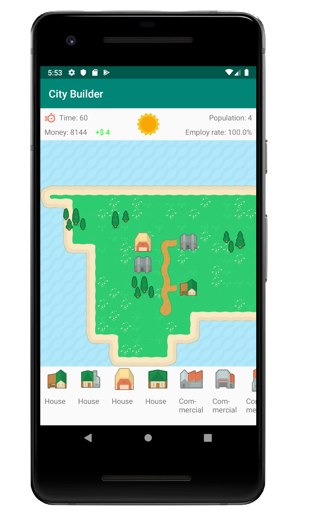

# CityBuilder

Android App            |  Android App
:-------------------------:|:-------------------------:
  |  

Based off SimCity where a user can build their own world.

1. Build a road or plant trees anywhere on land.
2. You can build housing and commercial properties adjacent to a road.
3. Increase time by pressing on the sun or the red clock in the top left hand corner.
4. You can can edit the name of a structure or even replace it with a photo taken from the camera in the details panel.
5. Play until you run out of money. After you can choose to continue playing for fun or start a new game.
6. If you find the game too challenging or too easy you can adjust the settings from the home page. Here you can also adjust the size of the map. 
